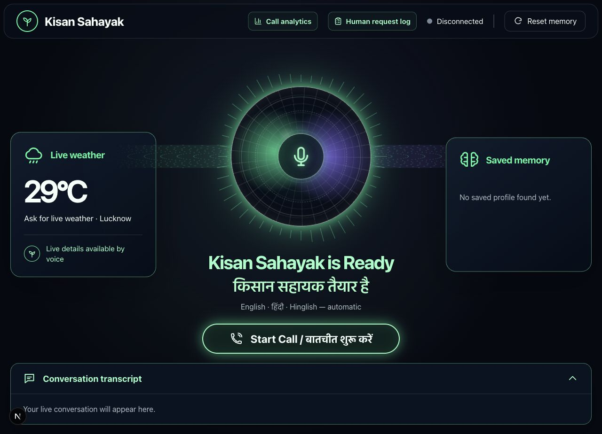
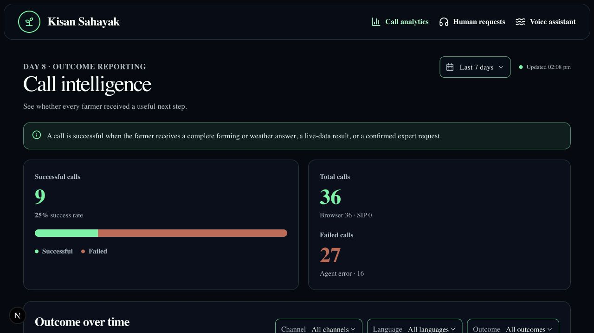
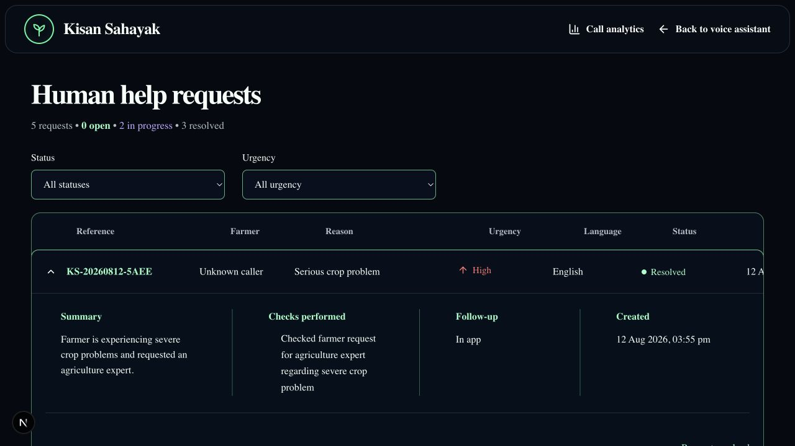
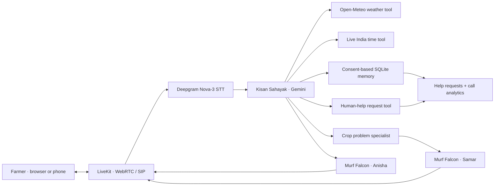

# Kisan Sahayak — Multilingual Farming Voice Agent

Kisan Sahayak is a browser and phone-based voice assistant for Indian farmers. It answers practical farming questions, matches English, Hindi, or Hinglish automatically, uses live weather data, remembers consented details, and knows when to involve a specialist or a human expert.

Built for **10 Days of Voice Agents — VoiceForBharat Edition** with low-latency speech powered by **Murf Falcon** and real-time transport powered by **LiveKit**.

[](LICENSE)
[](https://murf.ai/api/docs/text-to-speech/streaming)
[](https://docs.livekit.io)
[](https://nextjs.org/)
[](https://www.python.org/)



## Why voice?

A farmer standing in a field may have wet hands, bright sunlight, limited time, or limited comfort with typing. A voice-first assistant lets them ask a question naturally, change languages mid-conversation, and hear a short answer without navigating menus.

## What the agent can do

- Match the caller's latest turn in **English**, **Hindi written in Devanagari**, or **Roman-script Hinglish**.
- Answer farming, irrigation, soil, and crop-suitability questions in short spoken responses.
- Fetch timestamped district weather from Open-Meteo instead of inventing current conditions.
- Read the live India time from the system clock.
- Save and recall caller details only with permission.
- Place controlled outbound rain-advisory calls through a configured LiveKit SIP trunk.
- Ask before creating a privacy-safe human-help request.
- Record real browser and SIP call outcomes without storing full transcripts.
- Hand crop symptoms, pests, disease, and nutrient problems to a separate crop specialist agent.

## The 10-day build

| Day | Capability delivered                                                                            |
| --- | ----------------------------------------------------------------------------------------------- |
| 1   | Real-time STT → LLM → Murf Falcon TTS voice loop and latency benchmark                          |
| 2   | Farming personality, objectives, knowledge limits, and safety guardrails                        |
| 3   | Voice-first web portal with visible ready, connecting, listening, speaking, and ended states    |
| 4   | Consent-based caller memory backed by local SQLite                                              |
| 5   | Live district weather function tool with timestamps and a spoken failure path                   |
| 6   | Controlled outbound advisory calls with consent, quiet hours, and opt-out handling              |
| 7   | Human-help escalation with explicit permission, redaction, reference IDs, and a staff dashboard |
| 8   | Real call analytics for total, successful, and failed calls                                     |
| 9   | Conversation handoff from the main agent to a crop-problem specialist with a distinct voice     |
| 10  | Public build story, practical setup guide, screenshots, and repository documentation            |

## Product tour

### Call intelligence

A call is successful when the farmer asks a farming question and receives complete guidance, a live-weather result, or a confirmed expert request. Calls with no response, no farming question, an early exit, or an agent/tool failure are recorded as failed.



### Human-help request log

Only consented requests appear here. The dashboard stores a short redacted summary, urgency, language, checks performed, follow-up method, and status—never a full transcript, password, OTP, PIN, card number, or account number.



## How it works



### Core stack

| Layer               | Technology                             |
| ------------------- | -------------------------------------- |
| Speech-to-text      | Deepgram Nova-3                        |
| Language model      | Google Gemini `gemini-3.5-flash-lite`  |
| Text-to-speech      | Murf Falcon                            |
| Real-time transport | LiveKit WebRTC and SIP                 |
| Agent framework     | LiveKit Agents SDK                     |
| Backend             | Python 3.10–3.14                       |
| Frontend            | Next.js 15, React 19, TypeScript       |
| Persistence         | SQLite                                 |
| Live data           | Open-Meteo Geocoding and Forecast APIs |

During the Day 1 demonstration, observed time-to-first-audio values ranged from **137 ms to 263 ms**. Treat these as local observations, not a universal production benchmark; network, region, model, and device conditions affect end-to-end latency.

## Agent tools

| Tool                         | When it is used                                                            | Data source                         |
| ---------------------------- | -------------------------------------------------------------------------- | ----------------------------------- |
| `get_district_weather`       | Current weather, rain chance, temperature, wind, or same-day farm planning | Live Open-Meteo APIs                |
| `get_current_india_time`     | Current time or date in India                                              | Live system clock in `Asia/Kolkata` |
| `check_crop_suitability`     | Basic crop suitability for the participant location                        | Local rules                         |
| `get_caller_profile`         | Recall consented profile facts or a saved conversation summary             | Local SQLite                        |
| `save_caller_profile`        | Save only details the caller explicitly permits                            | Local SQLite                        |
| `create_escalation`          | Create a human-help request after explicit permission                      | Local SQLite                        |
| `handoff_to_crop_specialist` | Transfer crop symptom, pest, disease, or nutrient questions                | Separate LiveKit agent              |

The weather tool times out after eight seconds. If the source is unavailable, the agent says live weather is unavailable and does not estimate a value. Every spoken weather result includes when the data was observed or forecast.

## Safety and privacy

- The latest turn controls the response language; history does not force a caller into Hindi or English.
- Hindi output uses Devanagari. Hinglish output stays in Roman script.
- Current weather and time must come from tools, never from model memory.
- Caller details are saved only after clear consent or a direct “remember this” request.
- Human escalation requires a separate yes/no consent turn.
- Sensitive number patterns and credentials are redacted from escalation summaries.
- Full transcripts are not stored in the analytics or help-request dashboards.
- Outbound calls require confirmed consent, enforce **08:00–20:00 IST**, and honor saved opt-outs.
- The crop specialist gives focused triage and safe next steps; it does not pretend to replace an on-site agronomist.

The full behavior contract lives in [`backend/src/agent.py`](backend/src/agent.py).

## Quickstart

### Prerequisites

- Python **3.10–3.14**
- Node.js **20+**
- [uv](https://docs.astral.sh/uv/)
- pnpm **9+**
- A [LiveKit Cloud](https://cloud.livekit.io/) project
- API keys for [Murf](https://murf.ai/api/dashboard), [Deepgram](https://deepgram.com/), and [Google AI Studio](https://aistudio.google.com/apikey)

### 1. Clone the repository

```bash
git clone https://github.com/Reet24-del/murf-livekit-starter.git
cd murf-livekit-starter
```

### 2. Create local environment files

```bash
cp backend/.env.example backend/.env.local
cp frontend/.env.example frontend/.env.local
```

Fill in these values:

| Variable                           | Used by              | Required                                 |
| ---------------------------------- | -------------------- | ---------------------------------------- |
| `LIVEKIT_URL`                      | Backend and frontend | Yes                                      |
| `LIVEKIT_API_KEY`                  | Backend and frontend | Yes                                      |
| `LIVEKIT_API_SECRET`               | Backend and frontend | Yes                                      |
| `MURF_API_KEY`                     | Backend              | Yes                                      |
| `DEEPGRAM_API_KEY`                 | Backend              | Yes                                      |
| `GOOGLE_API_KEY`                   | Backend              | Yes for the current Gemini configuration |
| `AGENT_NAME=kisan-sahayak-primary` | Frontend             | Recommended for explicit dispatch        |
| `LIVEKIT_SIP_OUTBOUND_TRUNK_ID`    | Outbound worker      | Day 6 only                               |

Keep both `.env.local` files private. They are ignored by Git and must never be committed.

### 3. Install dependencies

```bash
(cd backend && uv sync && uv run python src/agent.py download-files)
(cd frontend && pnpm install)
```

### 4. Start the browser agent and website

On macOS or Linux:

```bash
chmod +x start_app.sh
./start_app.sh
```

The script starts the backend agent as `kisan-sahayak-primary` and the frontend on **http://localhost:3001**. It writes logs to:

- `/private/tmp/kisan-sahayak-backend.log`
- `/private/tmp/kisan-sahayak-frontend.log`

To run the two services manually:

```bash
# Terminal 1
cd backend
KISAN_AGENT_NAME=kisan-sahayak-primary uv run python src/agent.py dev

# Terminal 2, from the repository root
cd frontend
AGENT_NAME=kisan-sahayak-primary pnpm dev -- --hostname 0.0.0.0 --port 3001
```

The application uses the LiveKit project configured in `.env.local`; a separate local LiveKit server is not required.

### 5. Open the product

- Voice assistant: [http://localhost:3001](http://localhost:3001)
- Call analytics: [http://localhost:3001/call-analytics](http://localhost:3001/call-analytics)
- Human-help requests: [http://localhost:3001/help-requests](http://localhost:3001/help-requests)

Click **Start Call / बातचीत शुरू करें**, allow microphone access, and speak.

## Try the important flows

| Flow                  | Example                                                             |
| --------------------- | ------------------------------------------------------------------- |
| English               | “What is the rain chance in Lucknow today?”                         |
| Hindi                 | “आज लखनऊ में बारिश की संभावना क्या है?”                             |
| Hinglish              | “Aaj Lucknow mein spray karna safe hai kya?”                        |
| Memory                | “My name is Reet and my district is Lucknow. Remember this.”        |
| Recall                | “What do you remember about me?”                                    |
| Main-agent route      | “How often should I water tomatoes?”                                |
| Specialist handoff    | “My tomato leaves have black spots and are curling.”                |
| Human escalation      | Report severe spreading damage, then explicitly approve the request |
| Normal non-escalation | “Which soil is suitable for wheat?”                                 |

## Outbound calls

The outbound worker accepts either a Linphone username or a consenting recipient's E.164 phone number. The LiveKit SIP trunk can be backed by Linphone for a free app-to-app demonstration or by a provider such as Twilio for a normal phone call.

Start the worker:

```bash
cd backend
uv run python -m telephony.outbound.agent dev
```

Validate a call without dispatching it:

```bash
uv run python -m telephony.outbound.dial \
  --to +91XXXXXXXXXX \
  --district Lucknow \
  --crop tomato \
  --language en \
  --consent-confirmed \
  --dry-run
```

Remove `--dry-run` only for a number you control or a recipient who agreed to the call. The CLI blocks missing consent, malformed destinations, saved opt-outs, and calls outside the allowed IST window.

## Data storage

Local SQLite data is stored in `backend/memory.db` and is ignored by Git. It contains:

- consented caller profile facts and short conversation memories;
- outbound opt-outs;
- redacted human-help requests;
- privacy-safe call outcomes.

Do not publish the database. The dashboards expose controlled fields only.

## Testing

Backend:

```bash
cd backend
uv run pytest -q
uv run ruff check .
```

Some LLM-evaluated tests require valid LiveKit and model credentials.

Frontend:

```bash
cd frontend
pnpm test:unit
pnpm format:check
pnpm exec tsc --noEmit
```

## Project structure

```text
murf-livekit-starter/
├── backend/
│   ├── src/
│   │   ├── agent.py                 # Main agent, specialist, tools, and voice pipeline
│   │   ├── weather.py               # Live Open-Meteo integration
│   │   ├── db.py                    # Consent memory and outbound opt-outs
│   │   ├── escalation.py            # Redacted human-help requests
│   │   ├── call_analytics.py        # Call outcome tracking and reporting
│   │   └── telephony/outbound/      # SIP worker, safety rules, and dial CLI
│   ├── tests/
│   └── .env.example
├── frontend/
│   ├── app/
│   │   ├── call-analytics/          # Day 8 dashboard route
│   │   ├── help-requests/           # Day 7 dashboard route
│   │   └── api/                     # LiveKit, memory, analytics, and escalation APIs
│   ├── components/app/voice-portal/ # Responsive voice experience
│   ├── public/screenshots/           # Real local product screenshots
│   └── .env.example
├── DAY10_BLOG.md                     # Publish-ready build story
├── DAY10_LINKEDIN.md                 # Short LinkedIn launch copy
└── start_app.sh                      # macOS/Linux launcher
```

## Deployment

Deploy the backend as a long-running Python worker and the frontend as a Next.js application. Both deployments must use the same LiveKit project and the same explicit agent name:

```dotenv
KISAN_AGENT_NAME=kisan-sahayak-primary
AGENT_NAME=kisan-sahayak-primary
```

Never place backend API secrets in `NEXT_PUBLIC_*` variables.

## Build story

Read [`DAY10_BLOG.md`](DAY10_BLOG.md) for the full journey, architecture lessons, debugging notes, and a practical guide to building a similar voice agent. A concise sharing caption is available in [`DAY10_LINKEDIN.md`](DAY10_LINKEDIN.md).

## Documentation

- [Backend guide](backend/README.md)
- [Frontend guide](frontend/README.md)
- [Murf Falcon documentation](https://murf.ai/api/docs/text-to-speech/streaming)
- [LiveKit Agents documentation](https://docs.livekit.io/agents/)
- [Open-Meteo API documentation](https://open-meteo.com/en/docs)

## License

[MIT](LICENSE)
